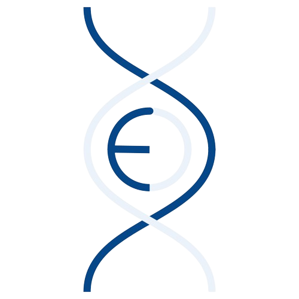
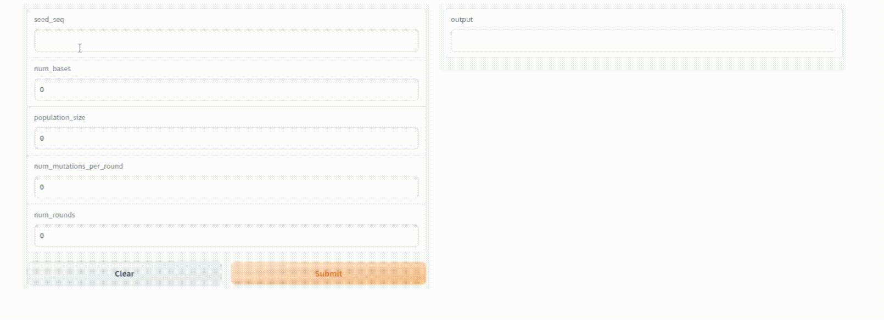
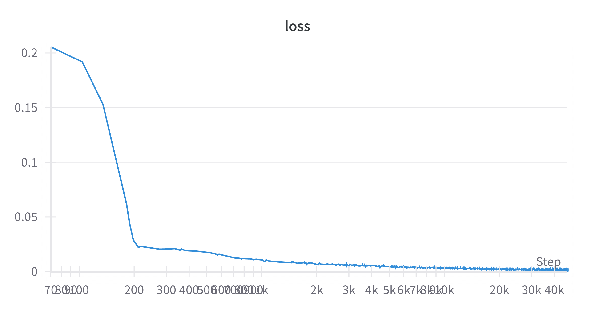
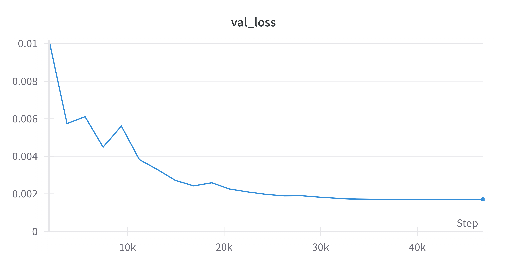
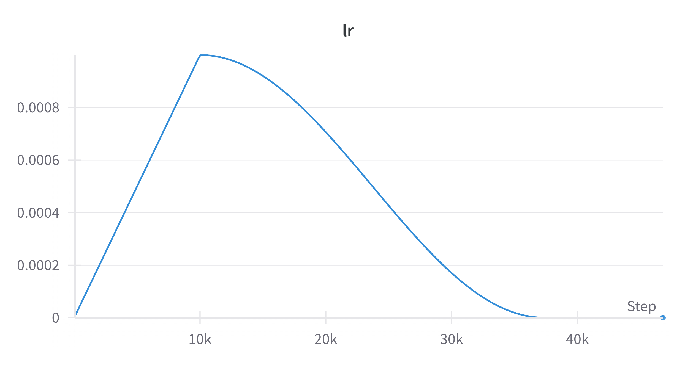

<h1 align="center">
  <br>
  

  <br>
  EngrAAV
  <br>
</h1>

<h4 align="center">An AI-based tool to design AAV-capsids optimized for production cost.</h4>

<p align="center">
  <a href="#abstract">Abstract</a> •
  <a href="#how-to-use">How To Use</a> •
  <a href="#try-online">Try Online</a> •
  <a href="#paper">Paper</a> •
  <a href="#training-figures">Training Figures</a> •
  <a href="#related-work">Related Work</a> •
  <a href="#support">Support</a> •
  <a href="#credits">Credits</a>
</p>



## Abstract
Adeno-associated viruses (AAVs), being the most clinically successful viral vectors, have shown promising results as the delivery vehicle for synthetically edited genes as part of the gene therapy process. However, the AAV manufacturing cost poses a significant bottleneck that prevents the widespread adoption of AAV-based gene therapy. Existing solutions aim to optimize AAVs through capsid engineering, a process that mutates capsids to increase viral yield and thereby proportionally decrease manufacturing costs. However, other phenotypes (symmetry and length) often degrade during this process, resulting in existing AAV capsids being either ineffective or too expensive to produce. This paper introduces EngrAAV, a novel Deep Learning-based directed evolution pipeline that aims to design AAVs optimized for cost while maintaining primary phenotypes. First, a stacked LSTM neural network is trained to accurately predict viral yield with a dataset containing ~300,000 AAV capsids. Once trained, a repeated evolution process is used: first, capsids are randomly mutated with amino acid insertions or substitutions; then, each capsid is fed through the LSTM model to determine the viral yield; lastly, capsids with the highest viral yield are selected for further mutagenesis. Throughout this process, both phenotypes are calculated through linear algebra and reverse translation, ensuring functionality and gene delivery effectiveness. Capsids designed with the EngrAAV pipeline were able to decrease the cost of manufacturing by ~96% while maintaining both basic phenotypes. Eight designed capsids were experimentally validated, all coming back with higher viral yields than unmutated capsids while maintaining both primary phenotypes.


## How To Use
This repo provides the code to train the model used for directed evolution.

To clone and run this application, you'll need [Python 3.9](https://www.python.org/) and a [Weights & Biases](https://wandb.ai/site) account. After installing both, from your command line:

```bash
# Clone this repository
$ git clone https://github.com/nikhilanayak/EngrAAV
 •
# Go into the repository
$ cd EngrAAV

# Install dependencies
$ pip install -r requirements.txt

# See the params for training
$ python src/train.py --help

# Run hyperparameter tuning algorithm to find best parameters (this will NOT train the final model)
$ python src/train.py --tune_hyperparams

# Or use default hyperparameters (this will save the model in ./model)
$ python src/train.py

# Once trained, run the directed evolution program to design optimized capsid sequences
$ python src/directed_evolution.py
```

> **Note**
> This code was developed/tested on Linux. It *should* work on all platforms, but support for specific GPUs or edge cases might require some changes.


## Try Online
An online app running the directed_evolution.py script is available on a [Hugging Face space](https://huggingface.co/spaces/nikhilnayak/EngrAAV). The app may require some time to warm up if it hasn't been recently visited. 

## Paper

The research paper for EngrAAV is still being drafted. However,a working copy of it is available [here](res/Nayak_Pai_EngrAAV.pdf) for those interested. 


## Training Figures

<p align="center">Training loss (over 25 epochs)</p>

---


<p align="center">Validation loss measured each epoch</p>

---


<p align="center">Learning rate warmup & exponential decay</p>

## Related Work

[Google AAV](https://github.com/google-research/google-research/tree/master/aav) - A google project that also utilizes ML for AAV optimization


## Support

If you used this project or any of its code, or had any questions, shoot me an email at nikhil.a.nayak@gmail.com.


## Credits

This work was done in conjungtion with Akash Pai as well as the OHSU lab. Akash helped with the biology aspect (namely experimental validation) while Dr. Hiroyuki Nakai and the Nakai Lab mentored Akash and I, giving their time and support as we worked on this project. 


## License
MIT
